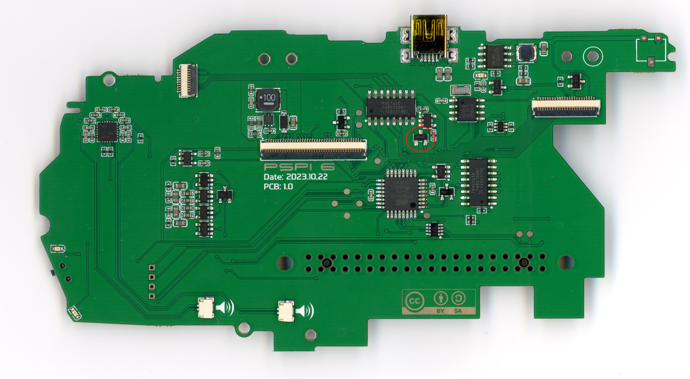

# PSPi 6: 2023.10.22 Production Board Notes and Fixes

## Ordering Notes
- The PSPi 6 mainboard needs double-sided assembly, which is pricey. The CM4 carrier also needs both sides be placed, but it is not too difficult to solder the GPIO header, SD card, and switch if you want to save some money. The headphone board only needs single sided assembly.

## Components to be Placed Manually

Some components are not available for automatic placement and must be placed manually. Below is the list of these components with links to purchase them:

1. **Gold Plated Beads/Pads for Joystick Contact**: [AliExpress Link for 1.0mm Beads](https://s.click.aliexpress.com/e/_DDhnfcj) or [AliExpress Link for 1.3mm](https://s.click.aliexpress.com/e/_DEbcF3V)
2. **PSP Barrel Jack SMD Connector**: [AliExpress Link](https://s.click.aliexpress.com/e/_DErpHYb)
3. **PSP Headphone Jack Connector**: [AliExpress Link](https://s.click.aliexpress.com/e/_DDpWHFz)

The following items are also needed:
1. **M2.5x6mm Standoffs**: [AliExpress Link](https://s.click.aliexpress.com/e/_DBPcEQb)
2. **M2.5 Washer (0.5mm Thick)**:
3. **M2.5 Screw (6mm Long)**:
4. **M2.5 Screw (3.5mm Long)**:
5. **Pin Protection 3D Print**

## Project Files
Access the editable schematics and PCBs on EasyEDA:
- [PSPi 6](https://oshwlab.com/adamseamster/pspi-zero-version-5_copy_copy)
- [CM4 Carrier Interface](https://oshwlab.com/adamseamster/pspi-version-6-cm4-interface)
- [Headphone Board](https://oshwlab.com/adamseamster/pspi-6-headphone-board)

### Bug 1: Power-on When Charging
- **Issue**: The board will power on as it is plugged in for charging.
- **Fix**: Replace R1 with a 100k resistor. Add a 100nF capacitor across the two top pads of Q2.

### Bug 2: Emergency Poweroff Too Early
- **Issue**: The supervisor IC is activating too early, and causing the board to power off when there's still 5% or so battery remaining.
- **Fix**: Replace U11 with a 2.6v supervisor.

