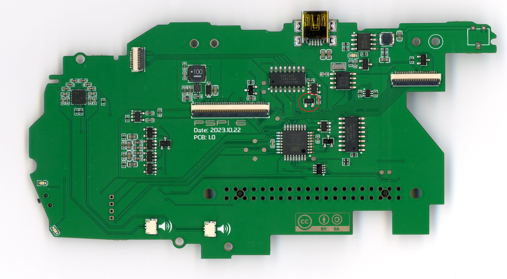

# PSPi 6 PCB 1.0 Notes and Fixes

## Changes Since Previous PCB
- Adjusted audio filter to help deal with PWM audio bug on Raspberry Pi 4 and Compute Module 4
- Fixed headphone/speaker switching bug
- Inverted activity LED function so it works with CM4
- USB muxing is no longer dependent on audio pins, and works regardless of whether audio is initialized
- Adjusted charge indicator so it is either fully orange or fully green, and not in between.

## Current Bugs

### Bug 1: [Spontaneous Power-On When Charging]
- **Issue**: The board powers on unexpectedly when a charger is connected, or when the board reaches high temperatures
- **Root Cause**: Temperature-dependent reverse leakage current in diodes D3 and D4 (marked W1). As the board temperature increases, these diodes allow an increasing amount of reverse leakage current, which enables the power-on circuit. Charging exacerbates this by adding heat and maintaining battery at full voltage
- **Fix**: Replace diodes D3 and D4 with BAV70 diodes (marked A4). The BAV70 has better temperature stability and lower reverse leakage. LCSC C2501 / BAV70,215 (~$0.02 per unit). This fix has been validated in testing at 100°C board temperature.

### Bug 2: [Emergency Poweroff Too Early]
- **Issue**: The supervisor IC is activating too early, and causing the board to power off when there's still 5% or so battery remaining.
- **Fix**: Replace U11 with a 2.6v supervisor. 
