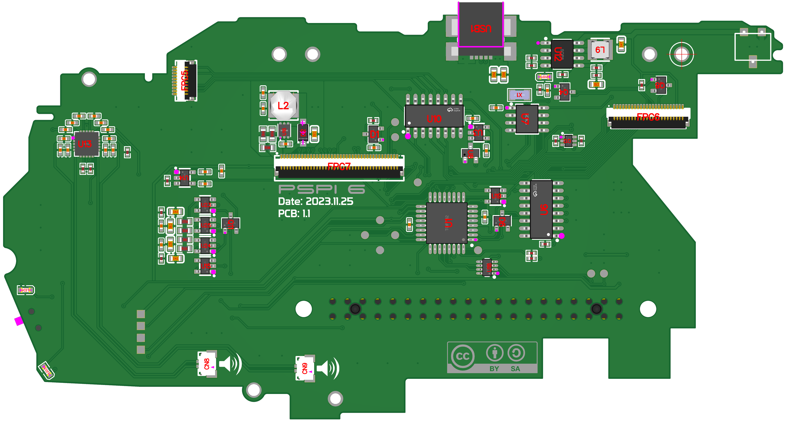
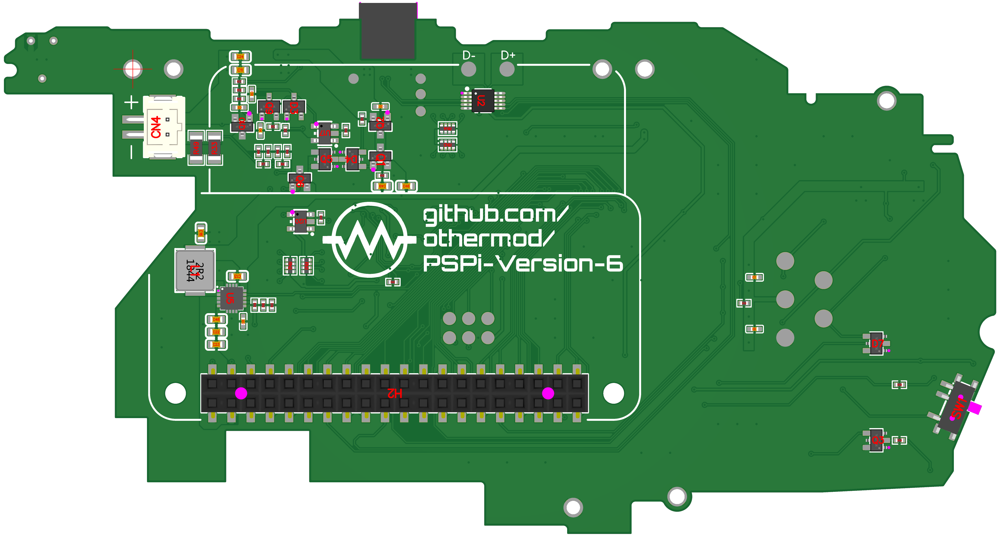

# PSPi 6 PCB 1.1 Notes and Fixes

## Ordering Notes
- All boards in this project are 0.8mm thick. The default size for PCBs is 1.6mm, so make sure to change it.
- The PSPi 6 mainboard needs double-sided assembly, which is pricey.
- The CM4 carrier also needs both sides be placed, but it is not too difficult to solder the GPIO header, SD card, and switch if you want to save some money.
- The headphone board only needs single sided assembly.

## Components to be Placed Manually

Some components are not available for automatic placement and must be placed manually. Below is the list of these components with links to purchase them:

1. **Gold Plated Pads for Joystick Contact**: [AliExpress Link for 1.3mm Pads](https://s.click.aliexpress.com/e/_DEbcF3V)
2. **PSP Barrel Jack SMD Connector**: [AliExpress Link](https://s.click.aliexpress.com/e/_DErpHYb)
3. **PSP Headphone Jack Connector**: [AliExpress Link](https://s.click.aliexpress.com/e/_DDpWHFz)

The following items are also needed:
1. **M2.5x6mm Standoffs**: [AliExpress Link](https://s.click.aliexpress.com/e/_DBPcEQb)
2. **M2.5 Washer (0.5mm Thick)**: [AliExpress Link](https://s.click.aliexpress.com/e/_DFXVGBT)
3. **M2.5 Screw (3mm Long)**: [AliExpress Link](https://s.click.aliexpress.com/e/_Dlp9Lxn)
4. **M2.5 Screw (5mm Long)**: [AliExpress Link](https://s.click.aliexpress.com/e/_Dlp9Lxn)
5. **Pin Protection 3D Print**

## Project Files
Access the editable schematics and PCBs on EasyEDA:
- [PSPi 6](https://oshwlab.com/adamseamster/pspi-zero-version-5_copy_copy)
- [CM4 Carrier Interface](https://oshwlab.com/adamseamster/pspi-version-6-cm4-interface)
- [Headphone Board](https://oshwlab.com/adamseamster/pspi-6-headphone-board)

## Changes Since Previous PCB
- Adjusted components leading to the power input mosfet so that the board doesn't power on when plugged in.
- Swapped 3v supervisor for a 2.6v one, so poweroff doesn't trigger too early.
- Switched to higher cost, lower resistance mosfets to reduce voltage drops on power rails.
- Removed through-hole on joystick pads, so I can attempt different connection methods.

## Current Bugs
No known bugs

## Alternate Parts

| Name                   | Manufacturer Part     | Alternate Part 1   | Alternate Part 2   | Alternate Part 3   |
|:-----------------------|:----------------------|:-------------------|:-------------------|:-------------------|
| BAT54C,215             | BAT54C,215            |                    |                    |                    |
| 1uH                    | TMPC0502HP-1R0MG-D    |                    |                    |                    |
| AO3401A                | AO3401A               |                    |                    |                    |
| AO3400A                | AO3400A               |                    |                    |                    |
| FSUSB42MUX             | FSUSB42MUX            |                    |                    |                    |
| TPS61230DRCR           | TPS61230DRCR          |                    |                    |                    |
| SN74LVC1G07DBVR        | SN74LVC1G07DBVR       |                    |                    |                    |
| MSK12C02-HB            | MSK12C02-HB           |                    |                    |                    |
| B2B-PH-SM4-TB (LF)(SN) | B2B-PH-SM4-TB(LF)(SN) |                    |                    |                    |
| FH-00369               | FH-00369              |                    |                    |                    |
| APX803S-26SA-7         | APX803S-26SA-7        |                    |                    |                    |
| B5819W_C8598           | B5819W SL             |                    |                    |                    |
| BCM857BS               | BCM857BS-7-F          |                    |                    |                    |
| ATMEGA8A-AU            | ATMEGA8A-AU           | ATMEGA16/32/64A-AU | ATMEGA168/328P     |                    |
| SGM2019-3.0YN5G        | SGM2019-3.0YN5G/TR    |                    |                    |                    |
| PCF8563T/5,518         | PCF8563T/5,518        |                    |                    |                    |
| IP2312                 | IP2312U_VSET          |                    |                    |                    |
| SN74LVC1G126DBVR       | SN74LVC1G126DBVR      |                    |                    |                    |
| TPS61160DRVR           | TPS61160DRVR          |                    |                    |                    |
| RS0102YH8              | RS0102YH8             |                    |                    |                    |
| 32.768kHz              | SMD31327681252090     |                    |                    |                    |
| U213-051N-4BH84        | U213-051N-4BH84       |                    |                    |                    |
| 2.2uH                  | SWPA3015S2R2MT        |                    |                    |                    |
| 74HC165D,653           | 74HC165D,653          |                    |                    |                    |
| TPA2012D2RTJR          | TPA2012D2RTJR         |                    |                    |                    |
| WF08002-01205          | WF08002-01205         |                    |                    |                    |
| AFC05-S10FIA-00        | AFC05-S10FIA-00       |                    |                    |                    |
| AFC05-S24FIA-00        | AFC05-S24FIA-00       |                    |                    |                    |
| AFC05-S40FIA-00        | AFC05-S40FIA-00       |                    |                    |                    |
| NRS5010T100MMGF        | NRS5010T100MMGF       |                    |                    |                    |
