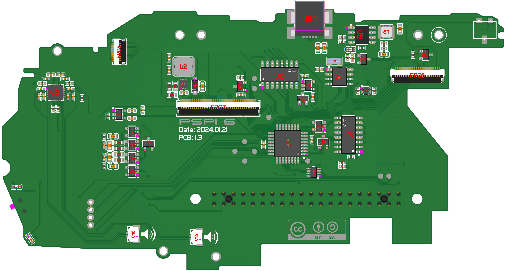
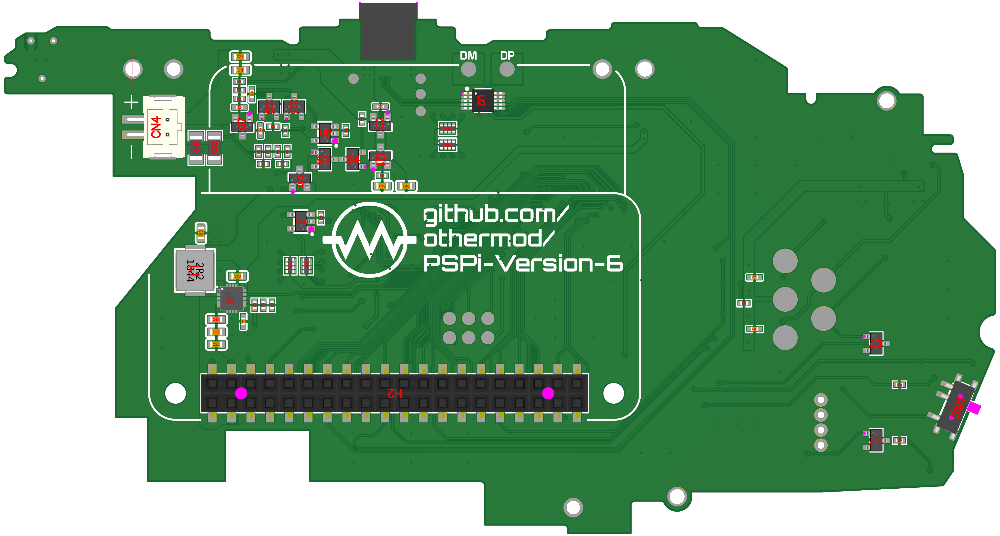

# PSPi 6 PCB 1.3 Notes and Fixes

## Ordering Notes (JLCPCB Specific)
- **Board Thickness**: All boards in this project are 0.8mm thick. JLCPCB's default is 1.6mm, so make sure to change this in your order.
- **Assembly Options**:
  - PSPi 6 Mainboard: Requires double-sided assembly (may increase cost)
  - CM4 Carrier: Requires double-sided assembly, but you can opt for single-sided and manually solder the GPIO header, SD card, and switch to save money
  - Headphone Board: Only needs single-sided assembly

## Components for Manual Placement
The following components are not available for automatic placement and must be added manually:

1. **Gold Plated Pads for Joystick Contact** (4 needed per board):
   - Option 1: 1.3mm Surface Mount Pads (Requires soldering by the user): [AliExpress Link](https://s.click.aliexpress.com/e/_DEbcF3V)
   - Option 2: Custom Manufactured Pins (Soldering is optional): [othermod link](https://othermod.com/product/pspi-6-joystick-contact-pads/)
2. **PSP Barrel Jack SMD Connector**: [AliExpress Link](https://s.click.aliexpress.com/e/_DErpHYb)
3. **PSP Headphone Jack Connector**: [AliExpress Link](https://s.click.aliexpress.com/e/_DDpWHFz)

## Additional Required Components
- M2.5x6mm Standoffs: [AliExpress Link](https://s.click.aliexpress.com/e/_DBPcEQb)
- M2.5 Washer (0.5mm Thick): [AliExpress Link](https://s.click.aliexpress.com/e/_DFXVGBT)
- M2.5 Screw (3mm Long): [AliExpress Link](https://s.click.aliexpress.com/e/_Dlp9Lxn)
- M2.5 Screw (5mm Long): [AliExpress Link](https://s.click.aliexpress.com/e/_Dlp9Lxn)
- Pin Protection 3D Print: [GitHub Link](https://github.com/othermod/PSPi-Version-6/blob/main/boards/pin_protection.obj)

## Project Files (EasyEDA)
- [PSPi 6 Main Board](https://oshwlab.com/adamseamster/pspi-zero-version-5_copy_copy)
- [CM4 Carrier Interface](https://oshwlab.com/adamseamster/pspi-version-6-cm4-interface)
- [Headphone Board](https://oshwlab.com/adamseamster/pspi-6-headphone-board)

## Recent Changes
- Improved joystick GND pad for easier soldering

## Notes
- Headphone and Carrier boards received no change. Use version 1.1.

## Known Issues
No known bugs at this time

