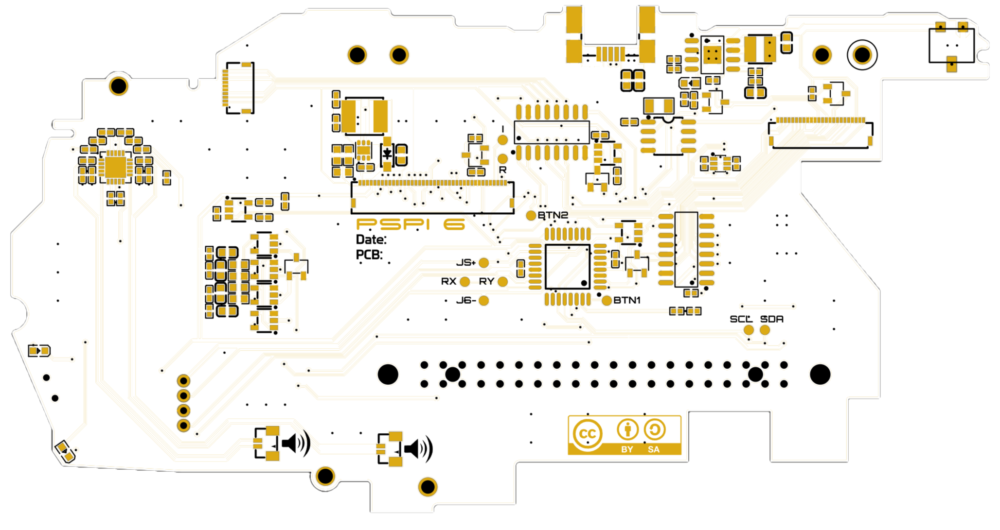
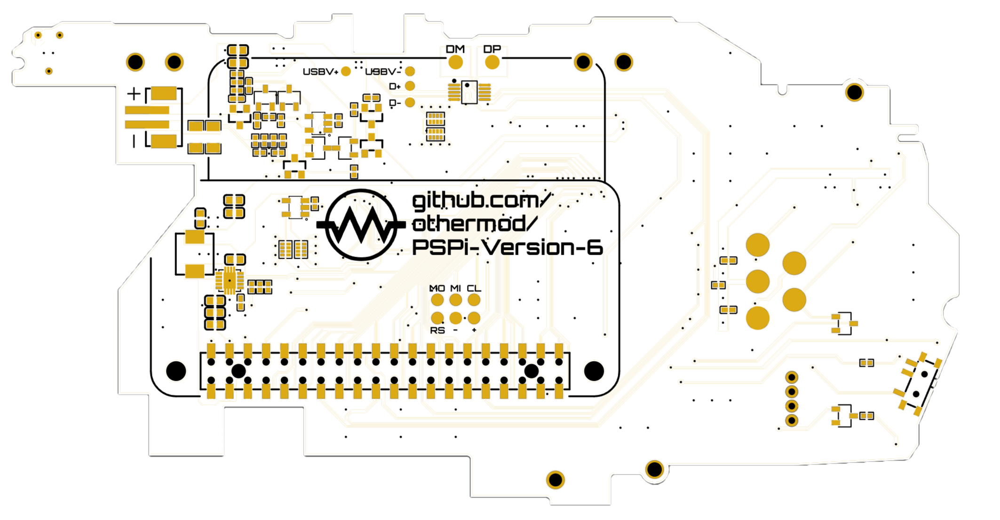

# PSPi 6 Boards

## Ordering Boards from JLCPCB

1. **Download Files**: Navigate to the folder and download the Gerber files for the board you want to order. If you want assembly, then also download the BOM and Pick and Place files.
2. **Visit JLCPCB Website**: Go to [JLCPCB](https://jlcpcb.com/?from=othermod).
3. **Upload Gerber Files**: Click on "Quote Now" and upload the downloaded Gerber file. If you want assembly, you will be asked to upload the BOM and Pick and Place files.
4. **Configure Board Settings**: Select the desired quantity, and choose the correct thickness **(0.8mm thickness for PSPi, carrier, and headphone)**.

Each board has some components that need manual placement. They also need additional components such as standoffs and washers. Check out the readme.md for each board for a full list of components needed.

## Board Layout

