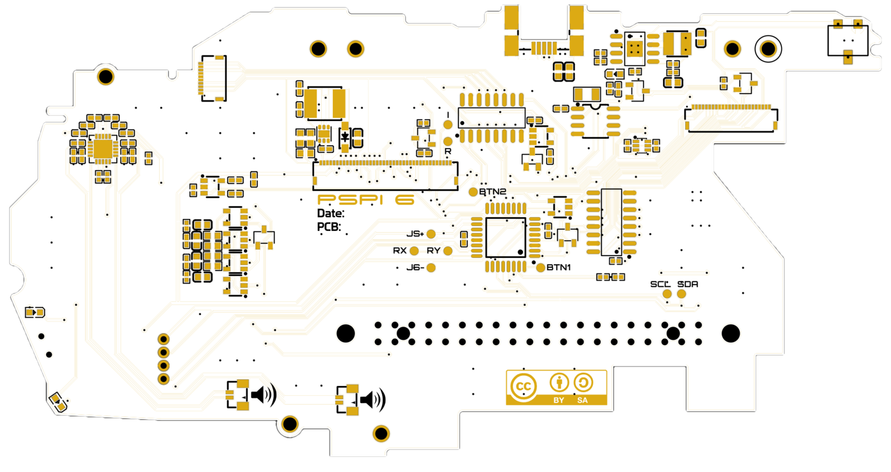
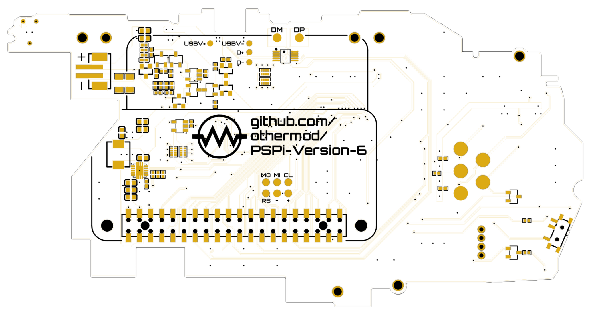

# PSPi 6 Boards

## Ordering Boards from JLCPCB

1. **Download Files**: Navigate to the folder and download the Gerber files for the board you want to order. If you want assembly, then also download the BOM and Pick and Place files.
2. **Visit JLCPCB Website**: Go to [JLCPCB](https://jlcpcb.com/?from=othermod).
3. **Upload Gerber Files**: Click on "Quote Now" and upload the downloaded Gerber file. If you want assembly, you will be asked to upload the BOM and Pick and Place files.
4. **Configure Board Settings**: Select the desired quantity, and choose the correct thickness **(0.8mm thickness for PSPi, carrier, and headphone)**.

## Components for Manual Placement

The following components are not available for automatic placement and must be added manually:

1. **Gold Plated Pads for Joystick Contact** (4 needed per board):
   - Option 1: 1.3mm Surface Mount Pads (Requires soldering by the user): [AliExpress Link](https://s.click.aliexpress.com/e/_DEbcF3V)
   - Option 2: Custom Manufactured Pins (Soldering is optional): [othermod link](https://othermod.com/product/pspi-6-joystick-contact-pads/)
2. **PSP Barrel Jack SMD Connector**: [AliExpress Link](https://s.click.aliexpress.com/e/_DErpHYb)
3. **PSP Headphone Jack Connector**: [AliExpress Link](https://s.click.aliexpress.com/e/_DDpWHFz)

## Additional Required Components

- M2.5x6mm Standoffs
- M2.5 Washer (0.5mm Thick)
- M2.5 Screw (3mm Long)
- M2.5 Screw (5mm Long)
- Pin Protection 3D Print: [GitHub Link](https://github.com/othermod/PSPi-Version-6/blob/main/boards/pin_protection.obj)

## Project Files (EasyEDA)

- [PSPi 6 Main Board](https://oshwlab.com/adamseamster/pspi-zero-version-5_copy_copy)
- [CM4 Carrier Interface](https://oshwlab.com/adamseamster/pspi-version-6-cm4-interface)
- [Headphone Board](https://oshwlab.com/adamseamster/pspi-6-headphone-board)

## Board Layout

