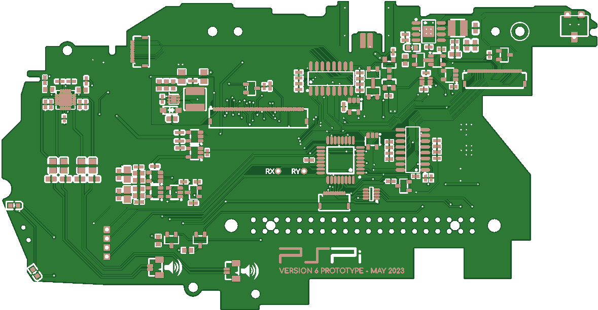
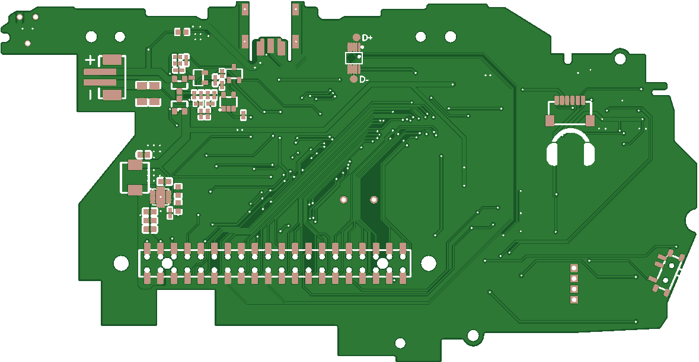

# PSPi 6 PCB 0.8

## Changes Since Previous PCB

- Initial prototype.

## Notes

- Rough prototype and the first version shown publicly on social media and YouTube.
- Experimented with the following features, which were later fine-tuned in PCB 0.9:
  - New charge IC
  - New audio amplifier
  - Mono/stereo muxing methods
  - USB switching for using either Pi Zero or CM4 USB connection
  - Firmware flashing methods

## Board Layout

